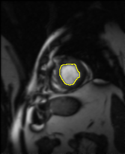
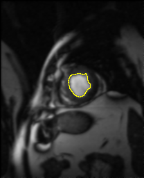

# level-set-segmentation
This project is realised to obtain license of computer sciences by 
  * YACINE MAKHTOUB 
  * RABAH LAOUADI

It's an implementation of the geometry algoritme "level sets"  to image contour detection (image segmentation), and same others filters algorithmes:
 * Gaussien
 * High-pass
 * Repoussage
 * Gradians (multiple implementations)
 * Sobel
 * Prewitt

It's applicated to detecte heart pathology with cycle given sequence 

